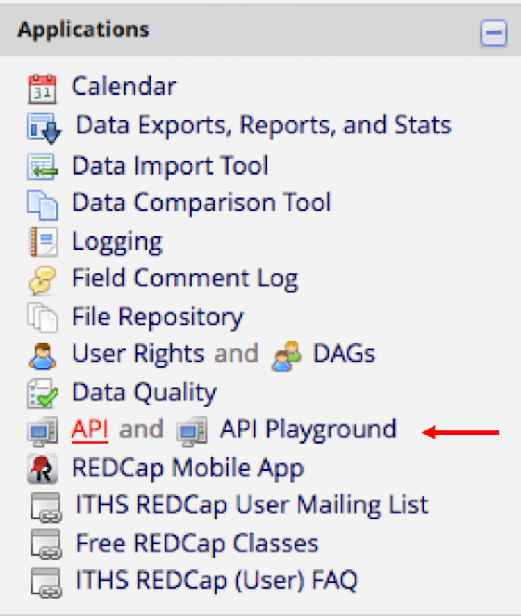
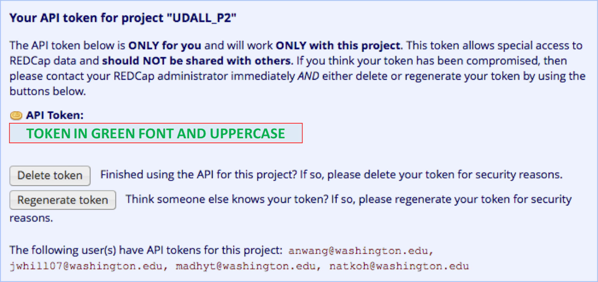

# UdallR
R functions to analyze data from the Udall Project 2 REDCap database. 


## Requesting REDCap token
You must generate a token through the REDCap website (https://redcap.iths.org/) in order to export the Udall data from REDCap.  

After logging in to REDCap, select "MyProjects" > "UDALL_P2" and then "API" under the "Applications" menu on the left-hand side.



If the "API" option is missing from the "Applications" menu, then someone in the project must give you privileges to see this page. If you are able to access the "API" page, there will be an option to request a new Application Programming Interface (API) token from the REDCap administrator. When your token request has successfully processed, your token should be printed out in green text on this page. A new token can be regenerated at any point by selecting "Regenerate token".





For more information, see REDCap's ducmentation of API tokens: https://redcap.iths.org/redcap_v7.1.2/API/help.php?content=default


## Loading the library functions
See this very helpful tutorial on creating an R library. https://hilaryparker.com/2014/04/29/writing-an-r-package-from-scratch/

You should probably have packages `devtools` and `roxygen` installed to work with this package. From the parent working directory that contains the UdallR folder, you should do the following:

```R
setwd("..")
install("UdallR")
```

## Using the library functions
You would use them using code that looks something like this, where you substitute your REDCap token where it says `INSERTTOKENHERE`. Don't commit this token to github. 

```R
require(REDCapR)
library(REDCapR)
dat <- as.data.frame(redcap_read(redcap_uri="https://redcap.iths.org/api/", token="INSERTTOKENHERE"))

cdat <- udallCleanREDCapDataWide(dat)
```